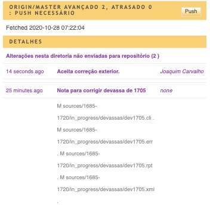

# Timelink project workflow with Git

## Main concepts

* Each project has a Git main repository.
* We distinguish __editors__ and __contributors__.
* Editors work on the main repository of the project.
* Contributors work on a forked repository.

## Main processes

### Review process

Editors review contributors' work and merge it with the main repository after reviewing.  

* To review the contributors work editors clone their repository
* To merge after reviewing they can simply copy the files from the collaborators' repositories or by merging the two repositories with git.

### Public replica of the database

A public replica machine can be installed in order to have a public version of the database synchronized with the main repository.

## Setup

### Setting up the initial reference repository and an editor

1. Fork the source template into a new repository for the project as 
explained in
[Create a new sources repository with a standard template](new_source_repository_from_template.md). 
Lets call this project repository _sources_reference_. 
2. Clone the `sources_reference` repository_ into an editor machine machine. 
3. Change the READ.me file. 
4. Push to github
5. Create a new `timelink/MHK` user associated with the new repository. 
See [Creating an user with sources in a git repository](new_user_sources_in_git.md)

### Setting up a contributor

1. Fork the `sources_reference` repository on github. Lets call the new repository `sources_collab`.
2. Generate a personal access token for this repository (see instruction bellow)
3. Clone the `sources_collab` repository on the collaborator machine.
4. Collaborator edits and adds content to the sources collection.
5. Collaborator pushes changes to `sources_collab` repository
6. Collaborator pull reviewed work and new information form `sources_collab repositoty` (collaborator never interacts with `sources_reference`).

### Setting up a public replica

See separate note 

....

## Workflow 

### Editor and collaborators interaction

Collaborators fork the main repository on github, and then clone to their machines.

They contribute and push back to their cloned repository, without disturbing the main repository.

To review the collaborators' work, editors clone the collaborators' repository into their machines.

They create an mhk user associated with the clone. This allows reviewing and editing the collaborator efforts.

Editor commits edits in the cloned collaborator repository and pushes them back to the remote.

Collaborator can then pull and incorporate the changes made by the editor.

If other changes are done to the main collection in the main repository that need to be shared with the contributors, the editor merges the upstream main repository into its clone of the collaborators repository and then pushes the result to github.  

From this merged stage a pull request can be issued to the main repository by the contributor.

## Gists

### Clone collab repo (collab machine)
    # first setup collab repository see above
    # change 
    COLLAB = NAME_OF_COLLAB_USER_ON_GITHUB
    PROJ = NAME_OF_PROJECT
    CTOKEN = (see instruction bellow)
    COLLAB_REPO = https://github.com/${COLLAB}/${PROJ}.git

    # this creates a PROJ directory in mhk-home/sources/
    mhk sources clone $COLLAB_REPO $CTOKEN $PROJ

### Clone main repo (editor machine)
    # first setup main repository see above
    # change 
    EDITOR = NAME_OF_EDITOR_USER_ON_GITHUB
    PROJ = NAME_OF_PROJECT
    PTOKEN = (see instruction bellow)
    MAIN_REPO = https://github.com/${EDITOR}/${PROJ}.git

    # this creates a PROJ directory in mhk-home/sources/
    mhk sources clone MAIN_REPO TOKEN PROJ

### Clone collaborator repo for review (editor machine)

    # change 
    COLLAB = NAME_OF_COLLAB_USER_ON_GITHUB
    PROJ = NAME_OF_PROJECT
    CTOKEN = # get from collaborator setup
    COLLAB_REPO = https://github.com/${COLLAB}/${PROJ}.git

    # creates a directorty names COLLAB-review in mhk-home/sources
    mhk sources clone $COLLAB_REPO $CTOKEN ${COLLAB}-review

### Sincronize collaborator repository with main repository (editor machine)

    # add upstream remote in collab repo for review (just once)
    cd ${COLLAB}-review
    git remote add upstream $MAIN_REPO

    # to sychronize with main 
    git fetch upstream
    git merge upstream/master 
    # review potential conflict and commit any changes
    git push upstream
    git log

## Dealing with merge conflicts

When merging main with collaborators conflicts may occur.

### Example

File in main repository:

Editor changes first lines:


Collaborator also changes first lines:

The Timelink/MHK interface shows that 
repository needs to be synchronized:

Pull from repository fails because of conflict:

(note that on the side bar the files affected by the conflict 
are prefixed with "UU" git status)


Merge conflict as seen in VS Code:

The incompatible changes are highlighted in color.
Above each conflict there is a line with the buttons
`Accept Current Change` and `Accept Incoming Change`

The "current change" refers to the change made on the
machine where VS Code is running and the "incoming change" to 
the change made somewhere else and pushed to the repository.

Click the one that corresponds to the desired result.
If a mix of both changes is the best solution then remove the
lines starting with "<<<<", ">>>>" and "=====" and edit
the text to the desired result.

Repeat for every conflict in every file. After solving the conflicts
save the files. They should no longer show in the VS Code "Merge changes" 
section of the git viewer. If they do it is because some conflict 
was missed or the files not saved after editing.

The files can now be commit with an appropriate message.

## Generate access tokens for the repository

Access token are necessary to allow `timelink/MHK` to access
the repositories.

On the github repository page:

1. Click on the user avatar on the top right of the page
2. Select Settings
3. Select Developer settings on the left menu
4. Select Personal access tokens on the left menu
5. Click on the Generate new token button
6. Type an easy to remember note. This note is all you will see in the future about this token, it will be necessary when you want to terminate the access to the repository with the token you are generating
7. Select repo
8. Click "Generate token" at the bottom of the page
Copy the token and store it safely

